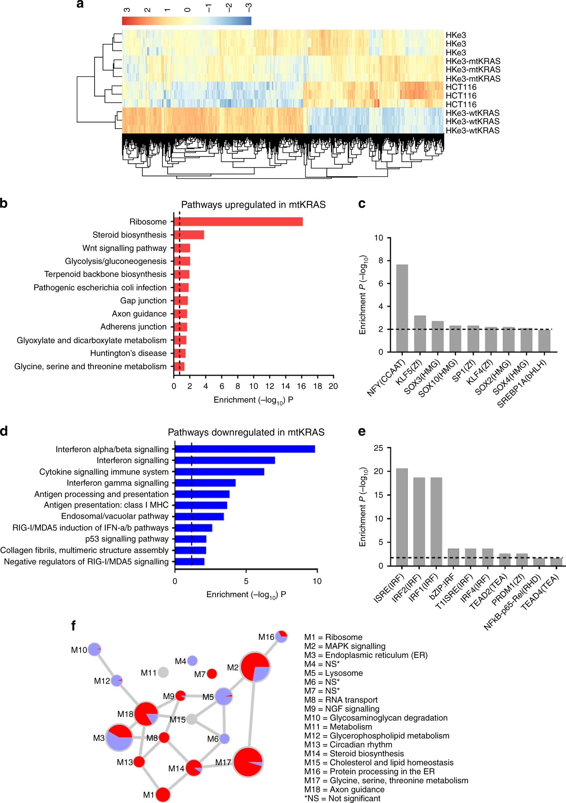

```{r setup, include=FALSE}
knitr::opts_chunk$set(echo = TRUE)
```

## Loading Required Packages
```{r message=FALSE}
if(! requireNamespace("BiocManager")) install.packages("BiocManager")
if(! requireNamespace("ComplexHeatmap")) BiocManager::install("ComplexHeatmap")
if(! requireNamespace("circlize")) install.packages("circlize")
if(! requireNamespace("gprofiler2")) install.packages("gprofiler2")
if(! requireNamespace("knitr")) install.packages("knitr")
if(! requireNamespace("kableExtra")) install.packages("kableExtra")
if(! requireNamespace("magrittr")) install.packages("magrittr")
if(! requireNamespace("edgeR")) install.packages("edgeR")
```

# Introduction
Here, we perform differential expression analysis and threshold over-representation analysis on an RNAseq dataset (GSE: GSE110649) from the paper "Transcriptional and metabolic rewiring of colorectal cancer cells expressing the oncogenic KRASG13D mutation" [@Charitou2019-yj]. Using this dataset, the paper attempts to compare the transcriptome of HKE3, a line of colorectal cancer cells, with mutant and wild type KRAS genes before TGF-alpha treatment and at five different time points after treatment ($t = 15, 30, 60, 90, 120$ minutes). 

Prior to this analysis, we first cleaned the data by filtering out genes with low counts per million, removing rows that lacked identifiers and altogether removing duplicate rows except for RNA-8S5, which we merged. After cleaning the dataset, we were left with 16827 rows of 58051 rows originally, i.e. a final coverage of 28.98%. Finally, we normalized the data by using the Trimmed Mean of M-values (TMM) method.  

Using the final dataset from A1, we will find which genes are differentially expressed and perform a preliminary analysis to see which genesets and pathways are enriched within these genes.  


## Loading the dataset

First, as the experiment performed in the original paper was rather complex, it was suggested to focus on a single aspect of it. In particular, I decided to focus on performing differential expression analysis on the mutant and wild-type cells before TGF$\alpha$ treatment (i.e. t=0). This was chosen as it is one of the main analyses done in the paper, whereas it revealed the pre-existing differences in the transcriptome of colorectal cancer cells HKE3 with mutant vs. wild type KRAS genes.

```{r}
# Loading the dataset
normalized_count_data <- read.delim("./GSE110649_normalized_data.csv",
                                    sep=",",
                                    check.names=FALSE,
                                    header=TRUE)

# Only keep columns corresponding to t=0
baseline_ind <- grepl("T0", colnames(normalized_count_data)) 
baseline_counts <- normalized_count_data[,baseline_ind] 
rownames(baseline_counts) <- normalized_count_data$Gene
```

<br>

# Differential Expression Analysis

## Define Groups

First, we define the groups based on the column names, i.e. whether each column is HKE3-mtKRAS or HKE3-wtKRAS and which replicate it is. 

```{r}
# Separate samples by "_" and keep the first and second indices
samples <- data.frame(lapply(colnames(baseline_counts),
                             FUN=function(x){unlist(strsplit(x,
                                                             split="_"))[c(1,3)]}))

# Replace the column names of "samples" with the actual column names of the data
colnames(samples) <- colnames(baseline_counts)
rownames(samples) <- c("cell_type", "replicate") 
samples <- data.frame(t(samples)) # Flip the col and row of the dataframe
```

## Check MDS plots for factors

Next, in order to choose the factors in our model, we look at the MDS plots. 

```{r fig.cap="Figure 1. MDS plot of normalized counts of HKE3-mtKRAS and HKE3-wtKRAS cells before treatment (t=0).", message=FALSE}
library(edgeR)
d = DGEList(counts=as.matrix(baseline_counts), group=samples$cell_type)

plotMDS.DGEList(d, labels=rownames(samples),
               col=c("darkgreen", "blue")[factor(samples$cell_type)])
```


From the MDS plot, we can see that the observations are clustered by cell type, which makes sense in terms of the experiment. Thus, we specify the model based on cell type and fit it.


```{r}
# Create model
model_design <- model.matrix(~ samples$cell_type) # Create model matrix
d <- estimateDisp(d, model_design) # Estimate dispersion
fit <- glmQLFit(d, model_design) # Fit model
```

Using this fitted model, we test for significance.


```{r}
qlf.mt_vs_wt <- glmQLFTest(fit, coef="samples$cell_typewtHKE3") # Perform significance test
tt_mt_vs_wt <- topTags(qlf.mt_vs_wt, n=nrow(d)) # Extract top hits from test
top_outputs <- tt_mt_vs_wt$table # Extract results table
```

Finally, we calculate the number of genes with p-values and FDR values which pass the significance threshold.


```{r}
ind_signif_p <- which(top_outputs$PValue < 0.05) # Get indices of top outputs with p-value < 0.05
ind_signif_fdr <- which(top_outputs$FDR < 0.05) # Get indices of top outputs with FDR < 0.05
num_p <- length(ind_signif_p)
num_fdr <- length(ind_signif_fdr)
```

Moving forward we will use the FDR in our work.


## Volcano Plot

In order to summarize our analysis, we demonstrate it in a volcano plot, as shown above. Here, we highlight genes of interest, i.e. those with FDR $< 0.05$ and absolute $log_2$ fold change greater than 1.5, as upregulated or downregulated based on the sign of their $log_2$ fold change. 

```{r fig.cap="Figure 2. Volcano plot of the top hits from the differential expression analysis of HKE3-mtKRAS to HKE3-wtKRAS cells before TGF-alpha treatment."}

# Label top hits with whether its been significantly upregulated/downregulated or there's no change
top_outputs$diffexpressed <- "No change"
top_outputs$diffexpressed[which(top_outputs$logFC > 1.5 & top_outputs$FDR < 0.05)] <- "Upregulated"
top_outputs$diffexpressed[which(top_outputs$logFC < -1.5 & top_outputs$FDR < 0.05)] <- "Downregulated"

cols <- rep("grey", nrow(top_outputs))
cols[which(top_outputs$logFC > 1.5 & top_outputs$FDR < 0.05)] <- "cornflowerblue"
cols[which(top_outputs$logFC < -1.5 & top_outputs$FDR < 0.05)] <- "orange"

library(ggplot2)

ggplot(data = top_outputs, aes(x=logFC, y=-log10(FDR), col=diffexpressed)) + 
  geom_point() + 
  scale_color_manual(values=c("orange", "grey", "cornflowerblue")) + 
  geom_hline(yintercept=-log10(0.05), col="black", lty=2) + # Add horizontal line a FDR = 0.05
  geom_vline(xintercept=c(-1.5, 1.5), col="black", lty=2) # Add vertical line at abs(logFC) > 1.5
```


## Heatmap

Finally, we create a heatmap to demonstrate the scaled differences in the normalized RNA counts of the top hits. 

```{r fig.cap="Figure 3. Heatmap of the scaled normalized RNA counts of the top hits found through differential expressions analysis of HKE3-mtKRAS to HKE3-wtKRAS cells before TGF-alpha treatment.", message=FALSE}

signif_genes <- rownames(top_outputs)[ind_signif_fdr] # Get names of significant genes
signif_baseline_ind <- which(rownames(baseline_counts) %in% signif_genes) # Get indices of significant genes in counts data

# Scale the data
scaled_hits_heatmap_matrix <- t(
  scale(t(as.matrix(baseline_counts[signif_baseline_ind,])))) 

library(circlize)

# Create the colorscales based on if there are negative scaled count values
if(min(scaled_hits_heatmap_matrix) < 0){
  colscale <- colorRamp2(c(min(scaled_hits_heatmap_matrix), 0, max(scaled_hits_heatmap_matrix)),
                           c("cornflowerblue", "white", "orange"))
} else {
  colscale <- colorRamp2(c(min(scaled_hits_heatmap_matrix), max(scaled_hits_heatmap_matrix)), 
                           c("white", "orange"))
}

library(ComplexHeatmap)

# Create heatmap
Heatmap(scaled_hits_heatmap_matrix,
        cluster_rows = TRUE,
        cluster_columns = TRUE,
        show_row_dend=TRUE,
        col = colscale,
        show_column_names = TRUE,
        show_row_names = FALSE,
        show_heatmap_legend=TRUE)
```

## Question 1
Here, we chose to use the standard significance threshold of $\alpha = 0.05$. We see that `r num_p` genes were significantly differentially expressed (i.e. their p-values were less than $0.05$). 

## Question 2
We use the false discovery rate (FDR) to correct for multiple hypotheses. We chose to use the FDR because firstly it is a less than stringent correction than Bonferroni's correction, thus allowing us to capture a larger set of significant genes. Next, we use FDR for convenience, as that is the default value of the edgeR `glmQLFTest()` function. Using the same standard significance threshold, we find that `r num_fdr` genes are significantly differentially expressed when considering the FDR. 

## Question 4
We display the original scaled normalized count data in a heatmap. Here, we see that the conditions cluster together. This makes sense because we only use one condition (HKE3-wtKRAS vs HKE3-mtKRAS) with biological replicates. Thus, it is to be expected that they will have similar transcriptomes save for some biological variation, and thus they will cluster together. Further, there seems to be a striking difference between the expression of the top hits between the two conditions, which nicely supports the validaty of our differential expression analysis process.  


<br>

# Thresholded List

We first create the threshholded lists based on a FDR $< 0.01$ and whether the log fold change was greater than or else than zero, as well as the whole list. 

```{r}
# Get indices of significant upregulated and downregulated
up_ind <- which(tt_mt_vs_wt$table$FDR < 0.01 & tt_mt_vs_wt$table$logFC > 0)
down_ind <- which(tt_mt_vs_wt$table$FDR < 0.01 & tt_mt_vs_wt$table$logFC < 0)

# Get gene names of upregulated genes
upreg <- tt_mt_vs_wt$table[up_ind,]
upreg_list <- rownames(upreg)

# Get gene names of downregulated genes
downreg <- tt_mt_vs_wt$table[down_ind,]
downreg_list <- rownames(downreg)

```


Next, we run the thresholded over-representation analysis using g:Profiler on the upregulated and downregulated thresholded lists. Using this, we can then find the number of pathways/gene sets found in each query.

```{r}
library(gprofiler2)

# Query gprofiler for upregulated list
gostres_up <- gost(query = upreg_list, 
                organism = "hsapiens", significant = FALSE, exclude_iea = TRUE, 
                correction_method = "fdr", 
                domain_scope = "annotated", 
                numeric_ns = "", sources = c("GO:BP", "REAC", "WP"))
 
# Query gprofiler for downregulated list
gostres_down <- gost(query = downreg_list, 
                organism = "hsapiens", significant = FALSE, exclude_iea = TRUE, 
                correction_method = "fdr", 
                domain_scope = "annotated", 
                numeric_ns = "", sources = c("GO:BP", "REAC", "WP"))

# Query gprofiler for whole list
gostres <-  gost(query = c(upreg_list, downreg_list), 
                organism = "hsapiens", significant = FALSE, exclude_iea = TRUE, 
                correction_method = "fdr", 
                domain_scope = "annotated", 
                numeric_ns = "", sources = c("GO:BP", "REAC", "WP"))

num_genesets_up <- nrow(gostres_up$result)
num_genesets_down <- nrow(gostres_down$result)
num_genesets_all <- nrow(gostres$result)
```

Next we filtered out terms that were too general and might obscure important pathways by only taking those with term size less than or equal to 200. 

```{r}
# Filter for terms with term_size <= 200
filtered_gos_up <- gostres_up$result[which(gostres_up$result$term_size <= 200),]
filtered_gos_down <- gostres_down$result[which(gostres_down$result$term_size <= 200),]
filtered_gos <- gostres$result[which(gostres$result$term_size <= 200),]
```

Finally, comparing the top ten entries of each list to one another, we get the following:
```{r message=FALSE}
library(magrittr)
library(kableExtra)

filtered_gos_up[1:12,c("term_name", "p_value")] %>% 
  kbl(caption="Table 1. Top filtered pathways hits for significantly upregulated wtKRAS genes.", row.names = FALSE, digits = 32) %>% 
  kable_styling()

filtered_gos_down[1:12,c("term_name", "p_value")] %>% 
  kbl(caption="Table 2. Top filtered pathways hits for significantly downregulated wtKRAS genes.", row.names = FALSE, digits = 52) %>% 
  kable_styling()

filtered_gos[1:12, c("term_name", "p_value")] %>% 
  kbl(caption="Table 3. Top filtered pathways hits for differentially expressed wtKRAS genes.", row.names = FALSE, digits = 32) %>% 
  kable_styling()
```
<br>

## Question 1
We ran a threshold gene set enrichment analysis on the top hits. In particular, we decided to use the R package version of g:Profiler. This is primarily because of pre-existing familiarity with the interface and process.

## Question 2
In terms of data sources, we use GO biological process, Reactome, and WikiPathways, since we are interested in the biological pathways and processes that these genes may be enriched in. Further, we exclude electronic GO annotations, as we would like high quality annotations, as discussed in class.

## Question 3
Using the thresholds FDR $< 0.05$ and whether logFC is greater than or else than zero, we get `r num_genesets_up` genesets for the upregulated genes, `r num_genesets_down` genesets for the downregulated genes, and `r num_genesets_all` genesets for the combined list. After we filtered for term sizes less than or equal to 200, we get `r nrow(filtered_gos_up)` genesets for upregulated genes, `r nrow(filtered_gos_down)` for downregulated genes, and `r nrow(filtered_gos)` for the combined list.

## Question 4
Comparing the results from the upregulated (Table 1) and downregulated thresholded (Table 2) lists to the combined list (Table 2), it seems that those with significantly larger p-values found in the individual thresholded lists appear on the combined list (i.e. cytoplasmic translation from Table 1, viral processes found in Table 2), however the others may not. This may be because the signal of these genesets are strong enough to appear as a top hit in the combined list, but those that are less strong may get buried when the two get combined. 


<br>

# Interpretation


## Question 1
Referencing Figure 2bc from the paper [@Charitou2019-yj], we can see that there exists similarities between the results above and the paper results. As the paper upregulates with mtKRAS and we upregulate with wtKRAS, we compare our upregulated pathways to their downregulated pathways and vice versa. 

Comparing Figure 2b from the paper with Table 4, we see that the top hit in theirs is "Ribosome", while the top hit in the above analysis is "cytoplasmic translation", which are reconcilable as the ribosome is responsible for cytoplasmic translation. The second hit for the paper is "steroid biosynthesis" while the second hit for the analysis above is "sterol biosynthesis process", which can also be reconcilable as sterols are a subgroup of steroids. The remaining do not seem to be in complete agreement. 

Next, comparing Figure 2d from the paper with Table 1, the top hits in both seem to contain pathways involving the immune system, inclding interferon and antigen related pathways. In addition, our analysis suggests that the downregulated gene list are enriched in pathways related to viruses and the negative regulation of viruses, which is reoncilable with the results from Figure 2d as interferons and cytokines are involved with the immune response to viral infection. 

As a result, while the top hits from the analysis performed above and the paper are not identical, they are quite similar. Further, it is not unexpected that they may be different as they use KEGG as their pathway data source, while we did not use this do to the paywall associated. As a result, the exact terminology and pathways may be different. Finally, while the results were not identical in nature, the pathways which had significantly higher p-values were represented in both lists which may be attributed to the strength of their signals. 



## Question 2

Finally, there is literature to support the results seen. First, looking at the pathways which are significantly upregulated in wtKRAS, we find that most if not all are related to the immune system (specifically antigens and interferon related pathways). Those that involve viruses can similarly be related to immune system pathways as they involve the regulation of these through the immune system. In addition, there is literature support that suggests that oncogenic mtKRAS is connected with inflammation and immune system modulation, leading to the creation of an environment in which tumours can grow and cancer cells may escape the body's immune response [@Pereira2022-vs]. Thus, based on this evidence, it may be reasonable to say that wtKRAS will be upregulated in these pathways as compared to wtKRAS.

Next, looking at significantly downregulated pathways in wtKRAS, these include various metabolic processes such as sterol, cholesterol, and pyruvate. This is supported by the paper, "KRAS-Driven Metabolic Rewiring Reveals Novel Actionable Targets in Cancer" [@Pupo2019-wf], which suggests that oncogenic mtKRAS is involved in the shifting of metabolism to anabolic processes in order to support cancer cell proliferation. This includes the break down of fats (i.e. sterols and cholesterol metabolism from the above analysis), as well as the synthesis of nucleotides, which requires pyruvates. Thus, as this suggests that these pathways may be upregulated in oncogenic mtKRAS as opposed to wtKRAS, they are downregulated in wtKRAs as opposed to oncogenic mtKRAS. 

Finally, the top hit of our threshold overrepresentation analysis for downregulation was cytoplasmic translation. This is also supported by literature evidence, which suggests that oncogenic mtKRAS will deregulate the PI3K/PDK1 RAS effector pathway which is involved in translation, cell growth, and proliferation [@Jancik2010-ue]. Thus, it is unsurprising that in our results, cytoplasmic translation is downregulated in wtKRAS as opposed to mtKRAS.   

<br>


  
# References
