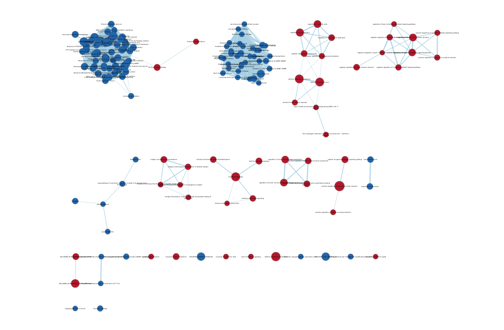
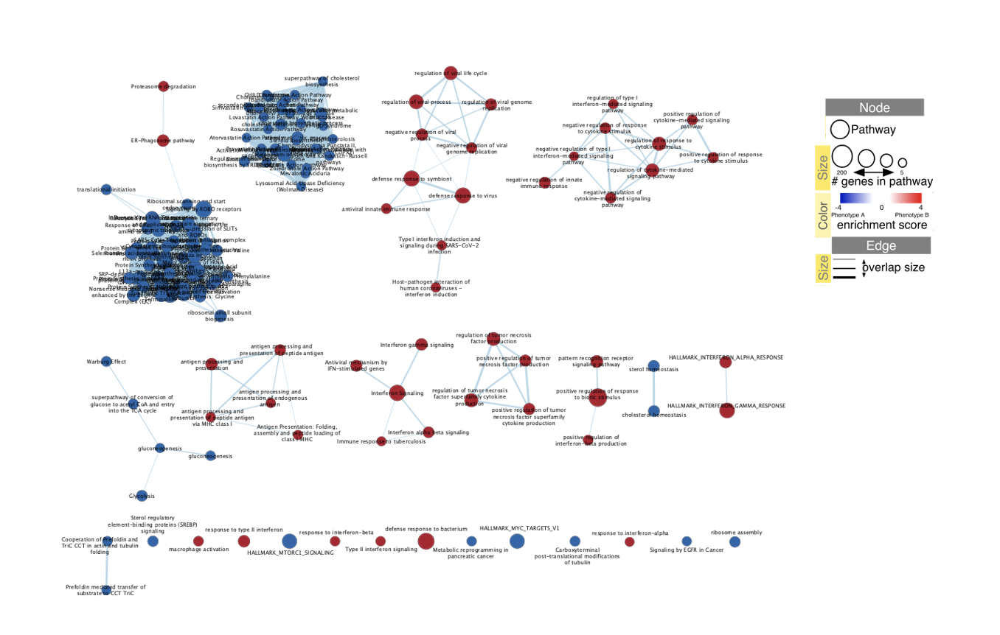
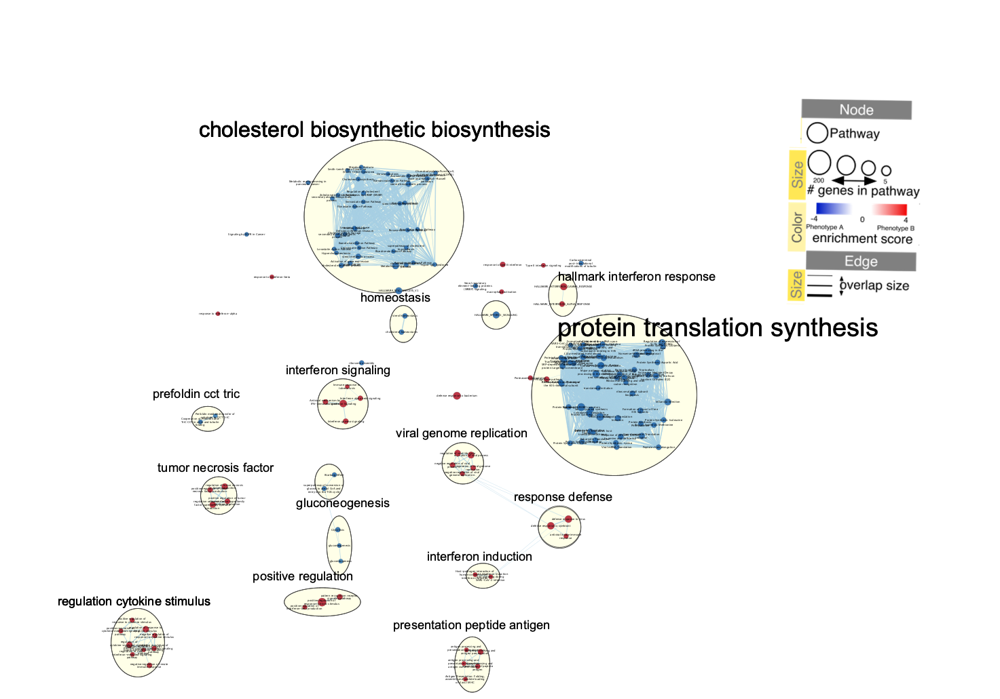

```{r setup, include=FALSE}
knitr::opts_chunk$set(echo = TRUE)
```

# Introduction

In this assignment we will perform non-thresholded gene set analysis, create an enrichment map, and perform dark matter analysis on an RNAseq dataset (GSE: GSE110649). This dataset, taken from the paper "Transcriptional and metabolic rewiring of colorectal cancer cells expressing the oncogenic KRASG13D mutation" [@Charitou2019-yj], compares the transcriptome of HKE3, a colorectal cancer cell line, with mutant KRAS (mtKRAS) and wild-type KRAS (wtKRAS) genes before TGF-alpha treatment and at five distinct intervals ($t = 15, 30, 60, 90$, and $120$ minutes) after treatment. In particular, we will focus on one goal of the paper: characterizing the transcriptomic differences between colorectal cancer cells with mtKRAS vs. wtKRAS. 

In Assignment 1, we first cleaned the data by removing rows with missing identifiers, genes with low counts per million, and duplicate rows entirely, with the exception of RNA-8S5, which we merged. After cleaning the dataset, we had 16827 rows instead of the initial 58051 rows, for a final coverage of 28.98%. Using this dataset, we then applied the Trimmed Mean of M-values (TMM) technique to normalise the data in order to reduce the effect of unwanted sources of variation on the data.  

Next, in Assignment 2, we initially filtered the dataset to only include the data taken at $t=0$. This was done, as we are only interested in defining the transcriptomic differences between the mtKRAS and wtKRAS prior to treatment. Next, we defined the model with the help of the MDS plot. This resulted in a fairly simple model, whereas we only included whether the sample had wtKRAS vs. mtKRAS. Using this, we used edgeR in order to perform differential expression analysis. This resulted in 2911 and 4061 genes being identified as significant when using FDR < 0.05 and p < 0.05 as a cutoff respectively. Finally, we ran a threshholded gene set enrichment analysis using G:Profiler. Using threshholds of FDR < 0.01, logFC = 0, and term size < 200, we obtained 8120 upregulated pathways and 7950 downregulated pathways for wtKRAS. These results were fairly similar to those obtained in the paper. 

From here, we will next perform non-threshholded gene set enrichment analysis using GSEA, represent this in an enrichment map using Cytoscape, and finally perform dark matter analysis. 

## Setting Up

### Required Packages
```{r message=FALSE}
if(! requireNamespace("RCurl")) {
  install.packages("RCurl")
  }; library(RCurl)

if(! requireNamespace("BiocManager")) {
  install.packages("BiocManager")
} 

if(! requireNamespace("ggplot2")) {
  install.packages("ggplot2")
  }; library(ggplot2)

if(! requireNamespace("RCy3")) {
  BiocManager::install("RCy3")
  }; library(RCy3)

if(! requireNamespace("httr")){
  install.packages("httr")
}; library(httr)

if(! requireNamespace("GSA")){
  BiocManager::install("GSA")
}; library(GSA)

if(! requireNamespace("circlize")){
  install.packages("circlize")
}; library(circlize)

if(! requireNamespace("ComplexHeatmap")){
  install.packages("ComplexHeatmap")
}; library(ComplexHeatmap)

if(! requireNamespace("magrittr")){
  install.packages("magrittr")
}; library(magrittr)

if(! requireNamespace("knitr")){
  install.packages("knitr")
}; library(knitr)

if(! requireNamespace("kableExtra")){
  install.packages("kableExtra")
}; library(kableExtra)
```

### Docker Configurations
```{r}
is_docker = TRUE # Set TRUE if compiling using Docker

if(is_docker){ # If using docker change base_url 
  curr_base = "host.docker.internal:1234/v1" 
  .defaultBaseUrl <- "http://host.docker.internal:1234/v1"
} else{ # Else use normal base_url
  curr_base = "localhost:1234/v1"
}
```

# Non-thresholded Gene set Enrichment Analysis

## Download the Gene Set

First, we download the Bader gene set for use in our analysis if it has not already been downloaded into the correct directory. This will be the resource we use to determine pathway enrichment in the later GSEA analysis.

```{r}
# Set gene-set file
geneset_file <- "Human_GOBP_AllPathways_no_GO_iea_April_02_2023_symbol.gmt" 

# Check if geneset does not exist, then download it
if(! file.exists(geneset_file)){
  
  # URL to get most recent gene set
  gmt_url = "http://download.baderlab.org/EM_Genesets/current_release/Human/symbol/"

  # Connect to URL and get html version of the page
  filenames = getURL(gmt_url)
  tc = textConnection(filenames)
  contents = readLines(tc)
  close(tc)
  
  # Create regular expression that will match the relevant file on the html page
  rx = gregexpr("(?<=<a href=\")(.*.GOBP_AllPathways_no_GO_iea.*.)(.gmt)(?=\">)", contents,
                perl = TRUE)
  
  # Get file names that match the regular expression
  gmt_file = unlist(regmatches(contents, rx))
  
  # Specify path of where to download the file
  geneset_file <- file.path(gmt_file)
  
  # Download the file
  download.file(paste(gmt_url, gmt_file, sep=""), destfile = geneset_file)
}
```

## Get Ranked List

Next, we calculate the ranks of each differentially-expressed gene and order them in descending order to create a ranked gene list. 

```{r}
# Get results from differential expression analysis
de_df <- read.csv("qlf_output_hits.txt")

# Create ranked dataframe
ranked_list <- data.frame(GeneName = de_df$X, 
                          rank = -log(de_df$PValue, base = 10) * sign(de_df$logFC))

# Ordered ranked dataframe in descending order by rank
ranked_list <- ranked_list[order(-ranked_list$rank),]

# Save ranked list
if(! file.exists("a3_ranked.rnk")){
  write.table(ranked_list, "a3_ranked.rnk", quote=FALSE, sep='\t', row.names = FALSE)
}
```

## Configurations for running the GSEA

Next, we set the configurations to run GSEA from R. 

```{r}
run_gsea = TRUE # Set to TRUE if running GSEA
working_dir <- getwd() # Get path of working directory to download items

# Create path to GSEA shell script
gsea_jar <- file.path(working_dir, "GSEA_4.3.2/gsea-cli.sh")

# Set path to the GSEA directory as blank for automatic detection
gsea_directory = ""

analysis_name <- "wtKRas_vs_mtKRas" # Set analysis name
rnk_file <- "a3_ranked.rnk" # Set name of pre-ranked file
```

## Run GSEA
```{r, message=FALSE, warning=FALSE}

if(run_gsea){
  
  # Create command with above configurations to run GSEA
  # Set max size of gene set as 200 and min as 15
  command <- paste(
    "",gsea_jar, # Shell script
    "GSEAPreRanked -gmx", geneset_file, 
    "-rnk" , rnk_file, 
    "-collapse false -nperm 1000 -scoring_scheme weighted -rpt_label ", analysis_name,
    "  -plot_top_x 20 -rnd_seed 12345  -set_max 200 -set_min 15 -zip_report false -out", working_dir, 
    " > gsea_output.txt",sep=" ")
  
  # Run command in terminal from R
  system(command)
}
```

## Get the name of the GSEA output directory
```{r GSEA output naming}
# Find GSEA directory if not specified
if(gsea_directory == ""){
  
  # In working directory, look for any file that contains the string ".GseaPreranked"
  gsea_directories <- list.files(path = working_dir, pattern = "\\.GseaPreranked")
  
  # Get details of the matching files, including time created
  details = file.info(file.path(working_dir, gsea_directories))
  
  # Order the files from newest created to oldest
  details = details[with(details, order(as.POSIXct(mtime),decreasing = TRUE)), ]
  
  # Select the newest file that was created
  gsea_output_dir <- row.names(details)[1]
} 
```

## Extract results
```{r}
# Find file path for GSEA pathway results
gsea_results_files <- file.path(gsea_output_dir, list.files(path=gsea_output_dir,
                                 pattern = "gsea_report_*.*.tsv"))

# Read pathway results into R
na_neg <- read.table(gsea_results_files[1], 
                        header=TRUE, 
                        sep="\t", 
                        quote="\"", 
                        stringsAsFactors = FALSE, 
                        row.names=1)

na_pos <- read.table(gsea_results_files[2], 
                        header=TRUE, 
                        sep="\t", 
                        quote="\"", 
                        stringsAsFactors = FALSE, 
                        row.names=1)
```

### Question 1
The method that I chose to use was GSEA (v4.3.2) [@Mootha2003-qe] [@Subramanian2005-ow], as it is a very widely-used method, indicating the scientific community's trust in it. The geneset I used was the Bader geneset from April 2, 2023 [@Merico2010-dy].

### Question 2
In regards to the enrichment results, we found 2397/5315 enriched pathways for wtKRas (125 of which were significantly upregulated at FDR < 25%), and 2918/5315 enriched pathways for mtKRas (332 of which were significantly enriched at FDR < 25%). The top hits for both include the following:
```{r echo=FALSE}
colnames(na_neg)[c(1,7)] <- colnames(na_pos)[c(1,7)] <- c("Pathway", "FDR")
na_neg$Pathway <- sub("\\%.*", "", na_neg$Pathway)
na_pos$Pathway <- sub("\\%.*", "", na_pos$Pathway)

na_neg[1:16, c(1,7)] %>% 
  kbl(caption="Table 1. Top enriched pathways for significantly upregulated mtKRAS genes.", row.names = FALSE, digits = 32) %>% 
  kable_styling()

na_pos[1:16,c(1,7)] %>% 
  kbl(caption="Table 2. Top enriched pathways hits for significantly upregulated wtKRAS genes.", row.names = FALSE, digits = 52) %>% 
  kable_styling()
```

In general, we see a significant enrichment in processes that govern the central dogma (i.e. transcription and translation-related processes) in mtKRas, and an enrichment in pathways relating to the immune response (i.e. interferons, cytokines, viral response) in wtKRas.

### Question 3

The top results are quite similar between the two, with many similar themes arising. For example, top hits from both include pathways relating to interferon response, regulation of viral reproduction, protein synthesis, and metabolic processes. This is because there is a pre-existing strong signal that may be easily captured by either method. It may be more difficult to compare the bottom hits as they may be more dependent on the specific analysis method and the parameters that were used, simply due to the fact that there is a weaker signal. 

<br />

# Visualize your Gene set Enrichment Analysis in Cytoscape

## Launch Cytoscape
First, check that Cytoscape is reachable from your device.
```{r}
# Make sure that Cytoscape is reachable
cytoscapePing(base.url = curr_base)
cytoscapeVersionInfo(base.url = curr_base)
```

## Define Parameters
Next, we define the parameters we would like to use in creating our Cytoscape enrichment map. 
```{r message=FALSE}
# File path for expression file
expression_file <- "GSE110649_normalized_data.txt"

# Define threshholds & params for Cytoscape 
pvalue_gsea_threshold <- "0.01"
qvalue_gsea_threshold <- "0.01"
similarity_threshold <- "0.375"
similarity_metric = "COMBINED"


# Get path to .edb results file
gsea_results_path <- file.path(gsea_output_dir,"edb")
gsea_results_filename <- file.path(gsea_results_path,"results.edb")

# Get original geneset file
gmt_gsea_file <- file.path(working_dir,geneset_file)
# Get ranks file from GSEA results
gsea_ranks_file <- file.path(gsea_results_path,list.files(gsea_results_path,pattern=".rnk"))

# Get full path for expression file
expression_file_fullpath <- file.path(working_dir, expression_file)
```

### (Optional) Define Docker Parameters
```{r}
# If using docker, need to adjust paths accordingly

if(is_docker) {
  
  # Upload the files to Docker and replace each path with the new Docker path
  upload_em_file <- function(localPath) {
    bname <- basename(localPath)
    r <- POST(
      url = paste('http://host.docker.internal:1234/enrichmentmap/textfileupload?fileName=', bname, sep=""),
      config = list(),
      body = list(file = upload_file(localPath)),
      encode = "multipart",
      handle = NULL
    )
    content(r,"parsed")$path
  }

  expression_file_fullpath <- upload_em_file(expression_file_fullpath)
  gmt_gsea_file <- upload_em_file(gmt_gsea_file)
  gsea_ranks_file <- upload_em_file(gsea_ranks_file)
  gsea_results_filename <- upload_em_file(gsea_results_filename)
}
```

## Run Cytoscape from R
```{r}
# Set the name of the Cytoscape network
curr_network_name <- paste(analysis_name,pvalue_gsea_threshold,qvalue_gsea_threshold,sep="_")

# Build the command that RCy3 uses to build the enrichment map
em_command = paste('enrichmentmap build analysisType="gsea" gmtFile=',gmt_gsea_file,
                   'pvalue=',pvalue_gsea_threshold, 'qvalue=',qvalue_gsea_threshold,
                   'similaritycutoff=',similarity_threshold,
                   'coefficients=',similarity_metric,
                   'ranksDataset1=', gsea_ranks_file,
                   'enrichmentsDataset1=',gsea_results_filename, 
                   'filterByExpressions=false',
                   'expressionDataset1=',expression_file_fullpath,
                   'gmtFile=',gmt_gsea_file)

# Parse the command so that it is compatible with CyREST and execute it
response <- commandsGET(em_command, base.url = curr_base)

current_network_suid <- 0

# Check if request has failed
if(grepl(pattern="Failed", response)){
  paste(response)
} else {
  current_network_suid <- response
}

# Get current network names from Cytoscape
current_names <- getNetworkList(base.url = curr_base)

# Check if the current network name is unique
if(curr_network_name %in% current_names){
  
  # If not unique, add the SUID to the front of the name so that it is unique
  curr_network_name <- paste(current_network_suid,curr_network_name,  sep="_")
}

# Rename the network
response <- renameNetwork(title=curr_network_name, 
                       network = as.numeric(current_network_suid), base.url = curr_base)
```

## Save Cytoscape Output
```{r}
# Define pathway to store output
output_network_file <- file.path(working_dir,"initial_screenshot_network.png")

# If not using docker
if(! is_docker){
  
  # Scale EM to fit screen
  fitContent()
  
  # If file already exists, remove it
  if(file.exists(output_network_file)){
    response <- file.remove(output_network_file)
  } 
  
  # Export image to defined pathway
  response <- exportImage(output_network_file, type = "png",base.url = curr_base)
}
```

## Questions 

### Question 1
The resulting map comprised of 152 nodes and 2000 edges. The thresholds I used for the creation of the map was $p = 0.01$, $q = 0.01$, and a similarity cutoff (i.e. Jaccard Overlap Combined) of 0.375. 

Below is the first view before manual manipulation:


### Question 2
In order to annotate the network, I used the default parameters. These include the following:

* Each node indicates a pathway
* The size of the node indicates the number of genes in the pathway
* The color of the node indicates the phenotype that the pathway is enriched for, where red is pathways that are enriched for the wtKRas and blue is pathways that are enriched for mtKRas
* The intensity of the color of the node indicates the enrichment score
* The edges between lines indicate the presence of common genes between the pathways
* The weight of the edges indicate the number of genes in common between the pathways


### Question 3


### Question 4

The major themes present in the enrichment analysis are metabolic pathways and protein synthesis for mtKRas, and immune response (i.e. "regulation cytokine stimulus", numerous interferon related clusters) for wtKRas (Figure below). These themes seem to fit well with the model, as they are able to nicely divide the two categories, wtKRAs and mtKRAS. In other words, each theme seems to contain a single category. These themes are also not necessarily surprising, given the result specified by the paper's model, the results from the GSEA, as well as the results from the threshholded analysis. This will be discussed in the next part. 

In addition, these major themes make intuitive sense should KRas be linked to the development colon cancer, as the paper suggests, as the upregulation of metabolic-related pathways and downregulation of immune-related pathways are common hallmarks of cancer. 

Finally, no themes found here are novel as compared to the results from the previous assignment and the paper. 


<br />
<br />

# Interpretation and detailed view of results

## Questions

### Question 1
The results I got mostly support the conclusions that were discussed in the original paper. 

In terms of comparing the transcriptome of mtKRAS cells and wtKRAS cells, the top pathways that were found to be enriched by the paper in mtKRAS were "ribosome", "steroid biosynthesis", "Wnt signalling pathway", and "glycolysis/gluconeogenesis". Similarly, looking at the top specific pathways (Table 1) and general themes (Figure 3), we see that these are mostly represented. From the GSEA result and Cytoscape themes, we see that there is an enrichment of protein synthesis-related pathways that are represented, gluconeogenesis, as well as cholesterol biosynthesis. These are all among the top results. However, pathways related to the Wnt signalling pathway were found to be enriched by GSEA, but were unable to pass the significance threshold of FDR < 25%. 

Next, the top pathways found to be enriched by the paper were "interferon alpha/beta signalling", "interferon signalling", "cytokine signalling immune system", "interferon gamma signalling", and "antigen processing and presentation". These are all represented in the top fifteen results in the GSEA analysis. 

Next, we compare these results to those from Assignment 2. As a reminder, in Assignment 2 we found that our threshholded analysis matched well with the paper's analysis, whereas the top upregulated pathways were protein synthesis-related pathways and steroid biosynthesis-related pathways, while the top downregulated pathways related cytokines and viral regulation, both of which are related to the immune response. 


### Question 2
There exists research to back up these findings. First, looking at pathways enriched in mtKRAS, we see several pathways relating to metabolism. Notably, we see pathways related to cholesterol metabolism and glucose metabolism. The study "KRAS-Driven Metabolic Rewiring Reveals Novel Actionable Targets in Cancer" [@Pupo2019-wf] indicates that oncogenic mtKRAS is involved in the metabolism's switch to anabolic processes to support cancer cell proliferation, which is in line with this. This involves the breakdown of fats (i.e., sterols and cholesterol metabolism from the above analysis). Further, elevated levels of PCK2 has been observed in colon cancer cells with mtKRAS. PCK2, a phosphoenolpyruvate carboxykinase, mediates gluconeogenesis in the absence of glucose [@Grasmann2019-qv]. Thus, these support the results seen in the analysis

Next, pathways relating to protein synthesis occupied most of the top enriched pathways found via GSEA for mtKRAS. This makes sense, as the PI3K/PDK1 RAS effector pathway, which is involved in translation, cell growth, and proliferation, is deregulated by oncogenic mtKRAS [@Jancik2010-ue]. As a consequence, it is not surprising that translation is upregulated in mtKRAS in our results.   

Finally, when we examine the pathways that are noticeably elevated in wtKRAS, we discover that the majority, if not all of them, are connected to the immune system (specifically antigens and interferon related pathways). Since they involve the immune system's regulation of these, those that involve viruses can also be linked to immune system pathways. Additionally, there is evidence in the literature to support the idea that oncogenic mtKRAS is linked to immune system modulation and inflammation, creating an environment in which tumours can develop and cancer cells may be able to resist the body's immune reaction. [@Pereira2022-vs]. In fact, mtKRAS has been found to control pathways with immunosuppressive properties. Thus, it has also been shown that by inhibiting oncogenic mtKRAS, interferon signalling is similarly increased [@Mugarza2022-uv]. As a result, it is not surprising that wtKRAS would have an noticeable enrichment of differentially expressed genes in immune-related pathways. 
<br />
<br />

# Dark Matter Analysis

First, we will read in the Bader lab gene set used for the GSEA analysis.
```{r}
# Read in the gene set
capture.output(genesets <- GSA.read.gmt(geneset_file), file="gsa_load.out")
names(genesets$genesets) <- genesets$geneset.names
```

## Get Significant Genes

Next, we will extract the significant, differentially expressed genes. We will define significance as those with FDR < 0.05. 

```{r}
# Filter for significantly differentially expressed genes
diff_expr_genes <- de_df$X[which(de_df$FDR < 0.05)]
```

## Get Relevant Lists of Genes

Here, we extract two lists of genes for our analysis. First, we will obtain a list of genes that are within the pathways that were found to be enriched in our GSEA analysis. Also, we will get the whole list of genes. 

```{r}
# Concatenate all enriched pathways into one list
enr_pathways <- c(rownames(na_neg), rownames(na_pos))

# Get all genes in enriched pathways
genes_enr_gs <- c()
for(i in 1:length(enr_pathways)){ # For every pathway in the enriched pathways
  
  # Get the genes that are in the pathway
  current_geneset <- unlist(genesets$genesets[which(genesets$geneset.names %in% enr_pathways[i])])
  genes_enr_gs <- union(genes_enr_gs, current_geneset)
}

# Get list of unique genes in the entire gene set
all_genes_gs <- unique(unlist(genesets$genesets))
```

## Extract Significant Genes not Contained in Gene Lists

From the obtained gene lists, we next obtain the significantly differentially expressed genes that are not represented in either gene list that we generated in the previous step. 

```{r}
# Get set of significantly differentially expressed genes not included anywhere in the geneset
no_annot <- setdiff(diff_expr_genes, all_genes_gs) 
# Get set of significantly differentially expressed genes not included in the enriched pathways
no_enr_annot <- setdiff(diff_expr_genes, enr_pathways)
```

## Create Heatmaps

Finally, we create heatmaps for the dark matter genes.

### Not Included in Bader Gene List
```{r fig.cap="Figure 4. Heatmap of the scaled normalized RNA counts of significant genes not found in any pathway in the gene list."}

# Get expression data 
expression <- read.table("GSE110649_normalized_data.txt", stringsAsFactors=FALSE)
baseline_ind <- grepl("T0", colnames(expression)) # Filter for "baseline" T0 data

# Get indices of significantly differentially expressed genes 
# not included anywhere in the geneset in the expression data
no_annot_ind <- which(expression$Gene %in% no_annot) 

# Scale the data
no_annot_matrix <- t(
  scale(t(as.matrix(expression[no_annot_ind, baseline_ind])))) 

# Create the colorscales based on if there are negative scaled count values
if(min(no_annot_matrix) < 0){
  colscale <- colorRamp2(c(min(no_annot_matrix), 0, max(no_annot_matrix)),
                           c("cornflowerblue", "white", "orange"))
} else {
  colscale <- colorRamp2(c(min(no_annot_matrix), max(no_annot_matrix)), 
                           c("white", "orange"))
}

# Create heatmap
Heatmap(no_annot_matrix,
        cluster_rows = TRUE,
        cluster_columns = TRUE,
        show_row_dend=TRUE,
        col = colscale,
        show_column_names = TRUE,
        show_row_names = FALSE,
        show_heatmap_legend=TRUE)
```

### Not Included in Enriched Gene Lists
```{r fig.cap="Figure 5. Heatmap of the scaled normalized RNA counts of of significant genes not found in GSEA-identified enriched gene lists.", message=FALSE}

# Get indices of significantly differentially expressed genes 
# not included anywhere in the enriched gene lists in the expression data
no_expr_annot_ind <- which(expression$Gene %in% no_enr_annot) 

# Scale the data
no_expr_annot_matrix <- t(
  scale(t(as.matrix(expression[no_expr_annot_ind, baseline_ind])))) 

# Create the colorscales based on if there are negative scaled count values
if(min(no_expr_annot_matrix) < 0){
  colscale <- colorRamp2(c(min(no_expr_annot_matrix), 0, max(no_expr_annot_matrix)),
                           c("cornflowerblue", "white", "orange"))
} else {
  colscale <- colorRamp2(c(min(no_expr_annot_matrix), max(no_expr_annot_matrix)), 
                           c("white", "orange"))
}

# Create heatmap
Heatmap(no_expr_annot_matrix,
        cluster_rows = TRUE,
        cluster_columns = TRUE,
        show_row_dend=TRUE,
        col = colscale,
        show_column_names = TRUE,
        show_row_names = FALSE,
        show_heatmap_legend=TRUE)
```

<br />
<br />

## References